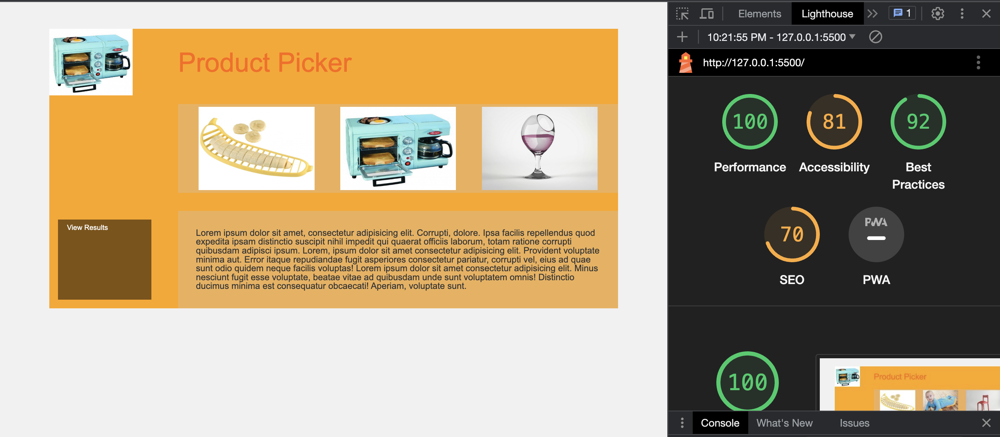

# LAB - 15B

## Odd Duck Products Application

Develop an application that showcases three images and keeps track of the number of times each image is viewed and clicked. The application should continue displaying a new set of images until a specified number of rounds is completed, with the default being 25 rounds. Once the rounds are finished, users can click the "view results" button to see the outcome. The application stores the data in local storage, ensuring that previous session data is retained.

## Author: Adnan Mohamud

## LightHouse Report SnapShot

